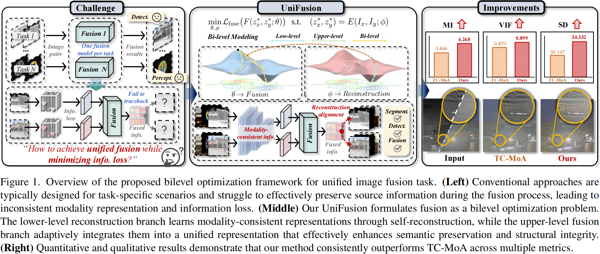
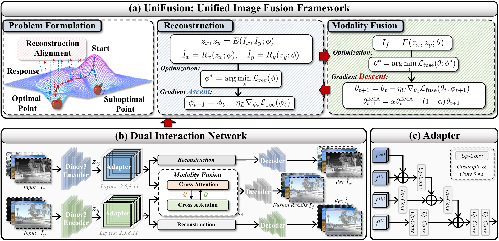
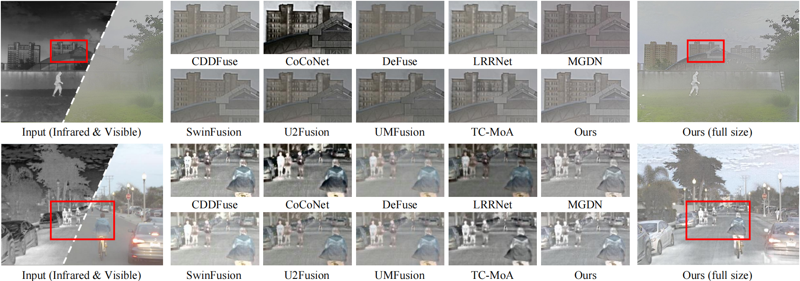

# UniFusion

This is the official Pytorch implementation of ["UniFusion: A Unified Image Fusion Framework with Robust Representation and Source-Aware Preservation"](http://arxiv.org/abs/2603.14214) which has been accepted by **The IEEE/CVF Conference on Computer Vision and Pattern Recognition (CVPR 2026)**!
## Abstract
Image fusion aims to integrate complementary information from multiple source images to produce a more informative and visually consistent representation, benefiting both human perception and downstream vision tasks. Despite recent progress, most existing fusion methods are designed for specific tasks (i.e., multi-modal, multi-exposure, or multi-focus fusion) and struggle to effectively preserve source information during the fusion process. This limitation primarily arises from task-specific architectures and the degradation of source information caused by deep-layer propagation. To overcome these issues, we propose \textbf{UniFusion}, a unified image fusion framework designed to achieve cross-task generalization. First, leveraging DINOv3 for modality-consistent feature extraction, UniFusion establishes a shared semantic space for diverse inputs. Second, to preserve the understanding of each source image, we introduce a reconstruction-alignment loss to maintain consistency between fused outputs and inputs. Finally, we employ a bilevel optimization strategy to decouple and jointly optimize reconstruction and fusion objectives, effectively balancing their coupling relationship and ensuring smooth convergence. Extensive experiments across multiple fusion tasks demonstrate UniFusion’s superior visual quality, generalization ability, and adaptability to real-world scenarios.


## Framework

The framework of the proposed SwinFusion for multi-modal image fusion and digital photography image fusion.

## Experiment
Download the training dataset and the dinov3_vits16 pre-trained model from [**Fusion dataset**](https://pan.baidu.com/s/1N9VWfRL4ysWR6y46zAYESw?pwd=tnf6).
Put the dataset in **./Dataset/trainsets/**. 
Put the dinov3 model in **./**.
### To Train
    python main_train_unifusion.py

### To Test
    python main_test_unifusion.py

 ### Visual Comparison

Visual comparison of infrared and visual image fusion results with SOTA methods on M3
FD (top) and T&R (bottom) datasets.

## Recommended Environment
 - [x] cuda 12.8
 - [x] torch 2.9.0
 - [x] torchvision 0.24.0
 - [x] tensorboard  2.20.0
 - [x] numpy 2.1.3

## Citation
```tex
@article{li2026unifusion,
  title={UniFusion: A Unified Image Fusion Framework with Robust Representation and Source-Aware Preservation}, 
  author={Li, Xingyuan and Du, Songcheng and Zou, Yang and Xu Haoyuan and Jiang Zhiying and Liu Jinyuan},
  journal={arXiv preprint arXiv:2603.14214}, 
  year={2026},
 }
```
## Acknowledgement
The codes are heavily based on [SwinFusion](https://github.com/Linfeng-Tang/SwinFusion). Please also follow their licenses. Thanks for their awesome works.
